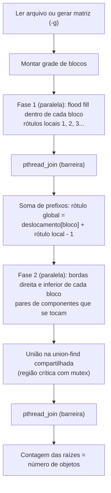
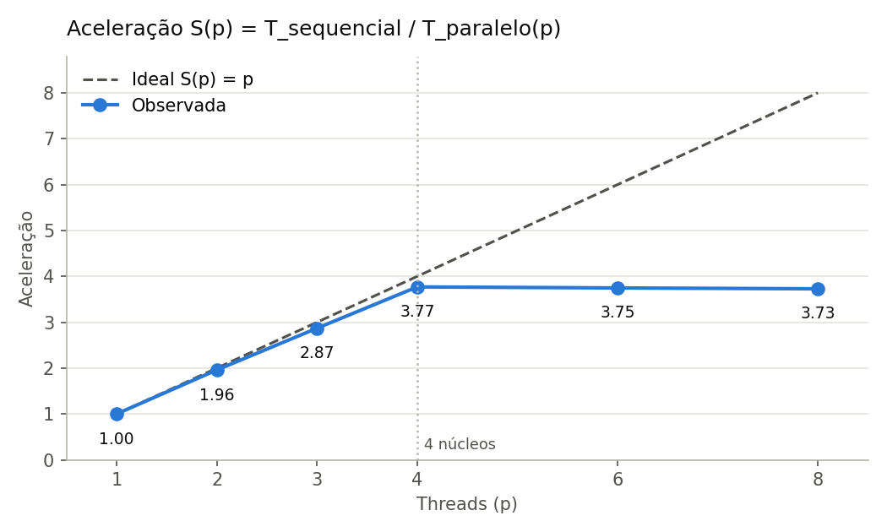

# Contagem paralela de objetos em uma matriz binária

Trabalho prático de **Sistemas Operacionais (2026/II)** — PUCRS, Escola Politécnica
Prof. Filipo Novo Mór

| Integrante | Matrícula |
|---|---|
| Lucas Gaelzer Machado | 23200069 |
| Stefan Chagas | 23200106 |

O programa conta os **objetos** de uma matriz binária, ou seja, os componentes de células `1` ligadas por **conectividade 8** (horizontal, vertical e diagonal). Há duas implementações funcionalmente equivalentes em ANSI C (C89):

- **`conta-objetos-sequencial`** — referência de correção e de desempenho: flood fill iterativo, com pilha explícita.
- **`conta-objetos-paralelo`** — versão paralela com **POSIX Threads**: a matriz é dividida em blocos, uma fila dinâmica distribui os blocos entre as threads, e os objetos que atravessam blocos são consolidados com union-find.

O relatório completo está em [`RELATORIO_TECNICO.md`](RELATORIO_TECNICO.md).

## Compilação

Requer um compilador C (gcc ou clang) e `make`, em Linux ou macOS.

```bash
make            # gera conta-objetos-sequencial, conta-objetos-paralelo e gera-matriz
make clean
```

Flags usadas: `-std=c89 -Wall -Wextra -pedantic -O2` (`-pthread` na versão paralela). A compilação não gera avisos com gcc 11/13 nem com clang 18.

## Execução

```bash
# Versão sequencial
./conta-objetos-sequencial [-v] arquivo.txt
./conta-objetos-sequencial [-v] -g LINHAS COLUNAS DENSIDADE SEMENTE

# Versão paralela
./conta-objetos-paralelo [-t THREADS] [-b LxC] [-v] arquivo.txt
./conta-objetos-paralelo [-t THREADS] [-b LxC] [-v] -g LINHAS COLUNAS DENSIDADE SEMENTE
```

| Opção | Significado |
|---|---|
| `-t N` | quantidade de threads (padrão 2, de 1 a 256) |
| `-b LxC` | grade de blocos, por exemplo `2x2` ou `3x3` (padrão: `2N x 2N`, limitada às dimensões da matriz) |
| `-v` | modo detalhado: mostra os blocos, os rótulos antes e depois da consolidação, as equivalências e a carga de cada thread |
| `-g L C D S` | gera em memória uma matriz `L x C` com densidade `D` de células 1 e semente `S`; a mesma semente gera a mesma matriz nas duas versões |

**Exemplo:**

```bash
./conta-objetos-sequencial tests/obrigatorios/exemplo3.txt
./conta-objetos-paralelo -t 4 -b 2x2 -v tests/obrigatorios/exemplo3.txt
```

### Formato do arquivo de entrada

A primeira linha traz `linhas colunas`, seguida das células `0`/`1`. Espaços e quebras de linha são ignorados, e `#` inicia um comentário.

```text
# esperado: 3
5 5
1 1 0 0 0
1 1 0 0 0
0 0 0 1 0
0 0 0 1 0
1 0 0 0 0
```

### Saída

```text
Versao: paralela (pthreads)
Matriz: 5 x 5
Threads: 4
Blocos: 2x2 (4)
Objetos: 3
Tempo (ms): 0.180
```

O tempo informado exclui a leitura ou geração da matriz e inclui a alocação dos rótulos, a criação e espera das threads, a rotulação, a consolidação e a contagem final.

## Arquitetura



- **Fila dinâmica de blocos:** um contador compartilhado protegido por `mutex_fila`. Cada thread retira o próximo bloco livre, o que equilibra a carga quando os blocos têm densidades diferentes.
- **Rótulos:** na fase 1, cada bloco é escrito por uma única thread; na fase 2, os rótulos são apenas lidos. Por isso não há escrita concorrente na mesma posição.
- **Consolidação:** cada thread acumula até 4096 pares em um buffer local e os aplica de uma vez na union-find, dentro da região crítica (`mutex_uniao`). Isso reduz a disputa pelo mutex.
- **Sem deadlock:** nenhuma thread segura dois mutexes ao mesmo tempo.
- **Determinismo:** a união sempre torna a menor raiz o representante, e a contagem final não depende da ordem das uniões.

## Testes

```bash
make test
```

O script [`scripts/testar.sh`](scripts/testar.sh) executa:

1. as **5 matrizes obrigatórias** ([`tests/obrigatorios/`](tests/obrigatorios)) e **10 casos adicionais** ([`tests/adicionais/`](tests/adicionais)), na versão sequencial e na paralela, com 1, 2, 3, 4 e 8 threads e com as grades padrão, `2x2`, `3x3`, `4x1`, `1x4`, `5x7` e um bloco por célula;
2. um teste de **determinismo**, com 50 repetições de cada configuração;
3. uma **comparação aleatória** entre sequencial e paralela em 200 matrizes geradas.

O valor esperado de cada caso adicional foi calculado por uma implementação independente em Python ([`scripts/referencia.py`](scripts/referencia.py)). Os registros ficam em `results/testes.log` e `results/testes-resumo.csv`.

| Exemplo | Dimensões | Esperado | Sequencial | Paralelo |
|---:|---:|---:|---:|---:|
| 1 | 5 x 5 | 3 | 3 | 3 |
| 2 | 6 x 8 | 4 | 4 | 4 |
| 3 | 8 x 8 | 5 | 5 | 5 |
| 4 | 9 x 12 | 6 | 6 | 6 |
| 5 | 12 x 12 | 7 | 7 | 7 |

Também estão disponíveis `make tsan` (ThreadSanitizer) e `make asan` (AddressSanitizer e UBSan).

## Desempenho

```bash
make bench       # gera results/medicoes.csv e results/ambiente.txt
make graficos    # gera results/resumo.csv e os gráficos (requer python3 + matplotlib)
```

Variáveis opcionais: `LINHAS`, `COLUNAS`, `DENSIDADE`, `SEMENTE`, `REPETICOES` e `THREADS`, por exemplo `THREADS="1 2 4 8" make bench`.

Resultados obtidos em um MacBook Air M4 (16 GB), em ambiente Linux com 4 núcleos, com matriz 8000 x 8000, densidade 0,30 e 3.023.082 objetos. Cada valor é a mediana de 10 repetições intercaladas:

| Versão | Threads | Tempo (ms) | Aceleração | Eficiência |
|---|---:|---:|---:|---:|
| Sequencial | 1 | 560,4 | 1,00 | 1,00 |
| Paralela | 1 | 559,5 | 1,00 | 1,00 |
| Paralela | 2 | 285,9 | 1,96 | 0,98 |
| Paralela | 3 | 195,3 | 2,87 | 0,96 |
| Paralela | 4 | 148,7 | 3,77 | 0,94 |
| Paralela | 6 | 149,5 | 3,75 | 0,62 |
| Paralela | 8 | 150,3 | 3,73 | 0,47 |

A aceleração cresce quase linearmente até o número de núcleos e se estabiliza depois dele. Em matrizes muito pequenas, como o exemplo 5 (12 x 12), a versão paralela é mais lenta: o custo de criar as threads supera o trabalho. A análise completa está na seção 9 do relatório.



## Estrutura

```text
.
├── README.md
├── RELATORIO_TECNICO.md
├── Makefile
├── src/
│   ├── conta-objetos-sequencial.c   versão sequencial
│   ├── conta-objetos-paralelo.c     versão paralela (pthreads)
│   ├── matriz.c / matriz.h          entrada, geração, pilha, tempo
│   └── gera-matriz.c                gera matrizes aleatórias em arquivo
├── tests/
│   ├── obrigatorios/                5 matrizes do enunciado
│   └── adicionais/                  10 casos criados pelo grupo
├── scripts/
│   ├── testar.sh                    testes funcionais
│   ├── medir.sh                     medições de desempenho
│   ├── graficos.py                  resumo estatístico e gráficos
│   ├── referencia.py                contagem independente em Python
│   └── gerar_adicionais.py          gera tests/adicionais
├── results/                         logs, medições e gráficos
└── slides/
    ├── apresentacao.pdf             slides da apresentação
    └── apresentacao.pptx            versão editável dos slides
```

## Ferramentas, referências e códigos externos

| Recurso | Uso |
|---|---|
| POSIX Threads e `clock_gettime` (biblioteca padrão do sistema) | criação de threads, mutexes e medição de tempo |
| Python 3 + matplotlib | scripts de verificação independente e de geração dos gráficos (fora do código C entregue) |
| Valgrind, ThreadSanitizer, AddressSanitizer | verificação de vazamentos e condições de corrida |
| Claude (Anthropic), assistente de IA | apoio na implementação, nos scripts de teste e na redação da documentação; os resultados foram verificados pelos testes automatizados descritos acima |
| Material de aula: *Processos e Threads no Linux e macOS* (Prof. Filipo Novo Mór) | conceitos de pthreads, mutex e regiões críticas |

Nenhuma biblioteca externa é usada no código C.
