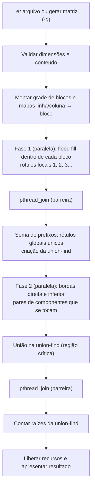
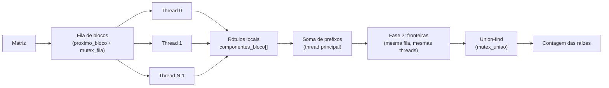
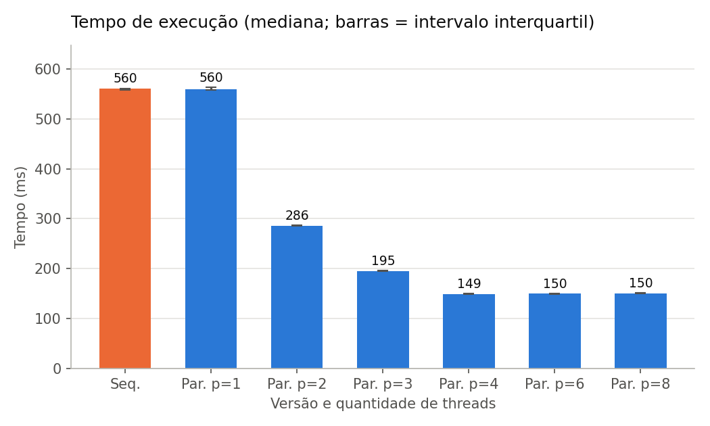
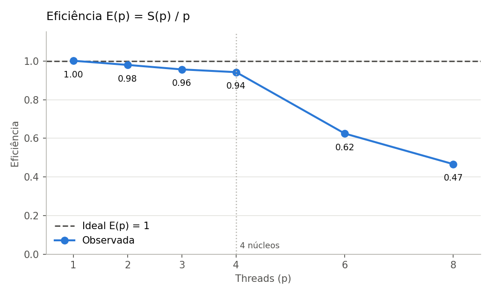

# Relatório técnico - Contagem paralela de objetos em uma matriz binária

> **Disciplina:** Sistemas Operacionais - 2026/II  
> **Professor:** Prof. Filipo Novo Mór  
> **Instituição:** Pontifícia Universidade Católica do Rio Grande do Sul - Escola Politécnica  
> **Repositório:** [github.com/LucasMachadoG/sisop-conta-objetos](https://github.com/LucasMachadoG/sisop-conta-objetos)  
> **Versão do relatório:** 1.0  
> **Data:** 06/10/2026

## Identificação

| Campo | Informação |
|---|---|
| Integrante 1 | Lucas Gaelzer Machado |
| Matrícula do integrante 1 | 23200069 |
| Integrante 2 | Stefan Chagas |
| Matrícula do integrante 2 | 23200106 |
| Modalidade | Dupla |
| Turma | 330 |
| Estratégia paralela | Pthreads |
| Plataforma testada | Linux (Ubuntu 22.04 aarch64 e Ubuntu 24.04 x86_64) |
| Commit avaliado | [`4be39fd`](https://github.com/LucasMachadoG/sisop-conta-objetos/commit/4be39fddfabf8aa97561aacdb36fcee57b00dab9) |

## Resumo

Este trabalho conta os objetos de uma matriz binária, definidos como componentes de células `1` ligadas por conectividade 8. A versão sequencial percorre a matriz em ordem de linhas e, a cada célula `1` ainda não rotulada, executa um flood fill iterativo com pilha explícita, o que evita recursão profunda em matrizes grandes. A versão paralela usa POSIX Threads: a matriz é dividida em uma grade de blocos, distribuídos por uma fila dinâmica protegida por mutex. Na primeira fase, cada thread rotula localmente os componentes dos blocos que retira da fila. Na segunda, examina as bordas desses blocos e registra os pares de componentes que se tocam, inclusive na diagonal e no encontro de quatro blocos. Esses pares são unidos em uma estrutura union-find compartilhada, dentro de uma região crítica. O número de objetos é a quantidade de representantes finais. As cinco matrizes obrigatórias, dez casos adicionais e 200 matrizes aleatórias produziram resultados idênticos nas duas versões, em 743 verificações. Em uma matriz de 8000 x 8000 executada em 4 núcleos, a versão paralela atingiu aceleração de 3,77 e eficiência de 0,94. Em matrizes muito pequenas, o custo de criar as threads supera o trabalho útil.

**Palavras-chave:** sistemas operacionais; paralelismo; processos; threads; conectividade 8; flood fill; componentes conexos.

## 1. Visão geral do problema

O programa recebe uma matriz binária na qual `0` representa o fundo e `1` representa o primeiro plano. Um objeto corresponde a um componente de células de valor `1` conectadas horizontalmente, verticalmente ou diagonalmente, conforme a **conectividade 8**.

O projeto contém duas implementações funcionalmente equivalentes:

1. uma versão sequencial, usada como referência de correção e de desempenho;
2. uma versão paralela baseada em **POSIX Threads (Pthreads)**.

### 1.1 Objetivos da implementação

- Contar corretamente os objetos com conectividade 8.
- Distribuir trabalho efetivo entre pelo menos duas unidades de execução.
- Reconhecer e unificar objetos que atravessam as divisões da matriz.
- Produzir resultados determinísticos e idênticos nas versões sequencial e paralela.
- Evitar condições de corrida, deadlocks, atualizações perdidas e contagens duplicadas.
- Avaliar correção, sobrecarga, escalabilidade, aceleração e eficiência.

### 1.2 Requisitos atendidos

| Requisito | Como foi atendido | Evidência no repositório |
|---|---|---|
| ANSI C C89/C90 | Todo o código compila com `-std=c89 -Wall -Wextra -pedantic` sem avisos, em gcc 11.4, gcc 13.3 e clang 18.1 | [`src/`](src/), [`Makefile`](Makefile) |
| Conectividade 8 | Vetores de deslocamento `VIZINHO_DL`/`VIZINHO_DC` com os 8 vizinhos; nas fronteiras, testes reto e diagonais | `src/matriz.c` (linhas 19-20); `examinar_fronteiras` em `src/conta-objetos-paralelo.c` |
| Versão sequencial | Flood fill iterativo com pilha explícita | [`src/conta-objetos-sequencial.c`](src/conta-objetos-sequencial.c), `contar_objetos_sequencial` |
| Versão paralela | Pthreads, grade de blocos, fila dinâmica, union-find | [`src/conta-objetos-paralelo.c`](src/conta-objetos-paralelo.c), `contar_objetos_paralelo` |
| Duas ou mais unidades concorrentes | `-t N` cria N threads de trabalho em cada fase; medido com 1 a 8 threads | `executar_fase`; [`results/medicoes.csv`](results/medicoes.csv) |
| Quantidade configurável de trabalhadores | Opção `-t N` (1 a 256) e grade de blocos configurável com `-b LxC` | `main` em `src/conta-objetos-paralelo.c` |
| Consolidação entre regiões | Rótulos globais por soma de prefixos, união dos pares de fronteira e contagem de raízes | `examinar_fronteiras`, `descarregar_pares`, `unir`, `encontrar` |
| Tratamento horizontal, vertical e diagonal | Cada célula de borda testa os 3 vizinhos do outro lado da fronteira | casos `exemplo2`, `exemplo3`, `a03-xadrez`, `a09-xis` em [`results/testes.log`](results/testes.log) |
| Verificação das chamadas POSIX | Retorno de `pthread_create`, `pthread_join`, `pthread_mutex_*` e `clock_gettime` verificado | `executar_fase`, `retirar_bloco`, `descarregar_pares`, `main`; `tempo_atual_ms` em `src/matriz.c` |
| Liberação dos recursos | Threads sempre aguardadas com join; mutexes destruídos; toda a memória liberada (Valgrind: *no leaks are possible*) | `liberar_contexto`, final de `main` |
| Compilação reproduzível | `make` com flags fixas; `make test`, `make bench`, `make graficos` | [`Makefile`](Makefile) |

## 2. Organização do repositório

```text
.
├── README.md
├── RELATORIO_TECNICO.md
├── Makefile
├── src/
│   ├── conta-objetos-sequencial.c
│   ├── conta-objetos-paralelo.c
│   ├── matriz.c
│   ├── matriz.h
│   └── gera-matriz.c
├── tests/
│   ├── obrigatorios/          (exemplo1.txt ... exemplo5.txt)
│   └── adicionais/            (a01 ... a10)
├── scripts/
│   ├── testar.sh
│   ├── medir.sh
│   ├── graficos.py
│   ├── referencia.py
│   └── gerar_adicionais.py
├── results/
│   ├── testes.log
│   ├── testes-resumo.csv
│   ├── ambiente.txt
│   ├── medicoes.csv
│   ├── resumo.csv
│   ├── grafico-tempo.png
│   ├── grafico-aceleracao.png
│   ├── grafico-eficiencia.png
│   ├── medicoes-pequena.csv   (+ pequena/: resumo e gráficos)
│   └── medicoes-exemplo5.csv  (+ exemplo5/: resumo e gráficos)
└── slides/
    └── apresentacao.pdf
```

| Caminho | Finalidade |
|---|---|
| `src/conta-objetos-sequencial.c` | Implementação sequencial de referência. |
| `src/conta-objetos-paralelo.c` | Implementação paralela com Pthreads. |
| `src/matriz.c`, `src/matriz.h` | Código comum: leitura e geração da matriz, pilha dinâmica, alocação verificada e medição de tempo. |
| `src/gera-matriz.c` | Gera matrizes aleatórias em arquivo texto, com o mesmo gerador da opção `-g`. |
| `tests/obrigatorios/` | Cinco matrizes obrigatórias do enunciado. |
| `tests/adicionais/` | Casos adicionais criados pelo grupo; cada um traz o valor esperado em comentário. |
| `scripts/testar.sh` | Testes funcionais, de determinismo e de comparação aleatória. |
| `scripts/medir.sh` | Medições de desempenho, com repetições intercaladas. |
| `scripts/graficos.py` | Resumo estatístico e gráficos a partir dos dados brutos. |
| `scripts/referencia.py` | Contagem independente em Python (BFS), usada como oráculo. |
| `results/medicoes*.csv` | Dados brutos das medições de desempenho. |
| `results/*.png` | Gráficos gerados a partir dos dados brutos. |
| `slides/apresentacao.pdf` | Slides utilizados na apresentação. |

## 3. Ambiente de desenvolvimento e execução

### 3.1 Hardware e software

As medições de desempenho (seção 9) foram feitas no notebook de um dos integrantes. A compilação e as verificações com sanitizadores e Valgrind também foram repetidas em uma segunda máquina Linux x86_64.

| Item | Especificação (medições de desempenho) |
|---|---|
| Processador | Apple M4 (MacBook Air) |
| Núcleos físicos | 10 no M4 (4 de desempenho + 6 de eficiência); 4 disponíveis ao ambiente de execução |
| Processadores lógicos | 4 |
| Memória RAM | 16 GB no Mac; 3,8 GB disponíveis ao ambiente de execução |
| Sistema operacional | Ubuntu 22.04 (Linux 6.8, aarch64), em ambiente virtualizado sobre macOS |
| Arquitetura | arm64 (aarch64) |
| Compilador | gcc 11.4.0 |
| Padrão da linguagem | C89/C90 |
| APIs POSIX utilizadas | `pthread_create`, `pthread_join`, `pthread_mutex_init/lock/unlock/destroy`, `clock_gettime(CLOCK_MONOTONIC)` |
| Flags de compilação | `-std=c89 -Wall -Wextra -pedantic -O2` (`-pthread` na versão paralela) |

Máquina de verificação: Ubuntu 24.04 x86_64 (Intel Xeon, 2 núcleos), gcc 13.3.0 e clang 18.1.3, com Valgrind, ThreadSanitizer e AddressSanitizer.

### 3.2 Compilação

```bash
make clean
make
```

Sem `make`:

```bash
cc -std=c89 -Wall -Wextra -pedantic -O2 -o conta-objetos-sequencial src/conta-objetos-sequencial.c src/matriz.c
cc -std=c89 -Wall -Wextra -pedantic -O2 -pthread -o conta-objetos-paralelo src/conta-objetos-paralelo.c src/matriz.c
```

### 3.3 Execução

```bash
./conta-objetos-sequencial [-v] (arquivo | -g LINHAS COLUNAS DENSIDADE SEMENTE)
./conta-objetos-paralelo [-t THREADS] [-b LxC] [-v] (arquivo | -g LINHAS COLUNAS DENSIDADE SEMENTE)
```

**Exemplo reproduzível:**

```bash
make
./conta-objetos-sequencial tests/obrigatorios/exemplo3.txt
./conta-objetos-paralelo -t 4 -b 2x2 tests/obrigatorios/exemplo3.txt
```

### 3.4 Formato da entrada e da saída

A matriz pode ser fornecida de duas formas:

- **Arquivo texto:** a primeira linha contém `linhas colunas`, seguida dos `linhas x colunas` dígitos `0`/`1`. Espaços e quebras de linha são ignorados, e `#` inicia um comentário até o fim da linha. O leitor rejeita caracteres inválidos e arquivos incompletos, informando a posição do erro.
- **Geração em memória:** `-g L C D S` gera uma matriz `L x C` em que cada célula vale `1` com probabilidade `D`, usando um gerador xorshift de 32 bits com semente `S`. A mesma semente produz a mesma matriz nas duas versões.

O número de threads é definido por `-t` (padrão 2) e a grade de blocos por `-b` (padrão `2T x 2T`, limitada às dimensões da matriz). A saída informa a versão, as dimensões, as threads, a grade, o número de objetos e o tempo do trecho medido.

```text
$ cat tests/obrigatorios/exemplo1.txt
# esperado: 3
5 5
1 1 0 0 0
1 1 0 0 0
0 0 0 1 0
0 0 0 1 0
1 0 0 0 0

$ ./conta-objetos-paralelo -t 2 -b 2x2 tests/obrigatorios/exemplo1.txt
Versao: paralela (pthreads)
Matriz: 5 x 5
Threads: 2
Blocos: 2x2 (4)
Objetos: 3
Tempo (ms): 0.158
```

Com `-v`, o programa mostra também os rótulos antes e depois da consolidação (em matrizes de até 4096 células), as equivalências encontradas, o tempo de cada etapa e a carga de cada thread (seção 7.4).

## 4. Arquitetura da solução

### 4.1 Fluxo geral



### 4.2 Estruturas de dados principais

| Estrutura | Tipo/representação | Responsabilidade | Compartilhada? | Proteção utilizada |
|---|---|---|---|---|
| Matriz de entrada | `unsigned char *` linear, `linhas x colunas` | Armazenar `0` e `1` | Sim | Não se aplica: somente leitura durante todo o processamento |
| Células visitadas/rótulos | `int *` linear do mesmo tamanho; 0 = fundo ou não visitado | Distinguir células processadas e guardar o rótulo local | Sim | Particionamento: na fase 1 cada bloco é escrito por uma única thread; na fase 2 é somente lido |
| Fila/pilha do flood fill | `Pilha` (vetor de `long` com crescimento por `realloc`) | Percorrer um componente sem recursão | Não: uma pilha por thread | Não se aplica |
| Tarefas/regiões | Grade `blocos_l x blocos_c`; contador `proximo_bloco` | Distribuir os blocos dinamicamente | Sim | `mutex_fila` |
| Equivalências de rótulos | Union-find `int *pai`, um elemento por componente local | Consolidar componentes | Sim | `mutex_uniao` |
| Resultados locais | `componentes_bloco[b]`, buffer de pares por thread | Contagens e equivalências parciais | `componentes_bloco`: sim; buffer: não | Cada posição de `componentes_bloco` é escrita só pela dona do bloco; o buffer é privado |

## 5. Implementação sequencial

### 5.1 Algoritmo

A matriz é percorrida em ordem de linhas, por um índice linear `inicio`. Um vetor `rotulos`, alocado zerado, marca as células já visitadas. Quando o laço encontra uma célula `1` com rótulo 0, incrementa o contador de objetos, atribui o novo rótulo à célula e a empilha. Enquanto a pilha não estiver vazia, desempilha uma célula, calcula sua linha e coluna e examina os 8 vizinhos com os vetores de deslocamento `VIZINHO_DL`/`VIZINHO_DC` (`-1/-1`, `-1/0`, `-1/+1`, `0/-1`, `0/+1`, `+1/-1`, `+1/0`, `+1/+1`). Cada vizinho dentro dos limites, com valor `1` e ainda não rotulado, recebe o rótulo **no momento em que é empilhado**, e assim nenhuma célula entra na pilha duas vezes. Ao final, o contador é o número de objetos.

### 5.2 Pseudocódigo

```text
FUNÇÃO contar_objetos_sequencial(matriz):
    rotulos ← vetor de L*C zeros
    objetos ← 0
    PARA inicio DE 0 ATÉ L*C - 1:
        SE matriz[inicio] = 1 E rotulos[inicio] = 0:
            objetos ← objetos + 1
            rotulos[inicio] ← objetos
            empilhar(inicio)
            ENQUANTO pilha não vazia:
                atual ← desempilhar()
                (r, c) ← (atual / C, atual mod C)
                PARA cada (dl, dc) nos 8 deslocamentos:
                    (nr, nc) ← (r + dl, c + dc)
                    SE 0 ≤ nr < L E 0 ≤ nc < C E matriz[nr][nc] = 1 E rotulos[nr][nc] = 0:
                        rotulos[nr][nc] ← objetos
                        empilhar(nr*C + nc)
    RETORNAR objetos
```

### 5.3 Complexidade e uso de memória

| Aspecto | Análise | Justificativa |
|---|---|---|
| Complexidade de tempo | O(L·C) | Cada célula é visitada pelo laço externo uma vez e empilhada no máximo uma vez; cada desempilhamento testa 8 vizinhos (custo constante). |
| Complexidade de espaço | O(L·C) | Matriz (1 byte por célula), rótulos (4 bytes por célula) e pilha, que no pior caso guarda o maior objeto (8 bytes por célula). |
| Risco de recursão excessiva | Não existe | O flood fill é iterativo, com pilha alocada no heap que cresce por duplicação (`pilha_empilhar`). Um objeto com milhões de células, como a matriz `a05-cheia` ampliada, não esgota a pilha de chamadas do processo. |

## 6. Implementação paralela

### 6.1 Modelo de concorrência

| Decisão | Escolha do grupo | Justificativa |
|---|---|---|
| Unidade de execução | Thread POSIX | A matriz e os rótulos precisam ser vistos por todos os trabalhadores; com threads, a memória já é compartilhada e o custo de criação é baixo. Com processos, seria preciso montar memória compartilhada (`mmap`/`shm_open`) ou pipes para devolver rótulos e equivalências. |
| Quantidade de trabalhadores | Opção `-t N` (1 a 256, padrão 2) | Permite variar `p` nos experimentos; 1 thread serve de linha de base para medir a sobrecarga. |
| Divisão do trabalho | Blocos retangulares (grade `-b LxC`, padrão `2T x 2T`) | Blocos têm perímetro menor que faixas de mesma área, o que reduz o trabalho de fronteira, e reproduzem as grades 2x2 e 3x3 do enunciado. |
| Escalonamento | Dinâmico (fila de blocos) | Com mais blocos do que threads, uma thread que termina cedo retira outro bloco. Isso compensa regiões de densidade diferente e núcleos de velocidades distintas. |
| Comunicação | Estruturas compartilhadas na memória do processo | Os resultados locais (rótulos, contagens por bloco, union-find) ficam em vetores comuns; a thread principal lê após o `pthread_join`. |
| Sincronização | 2 mutexes + `pthread_join` como barreira | `mutex_fila` protege o contador da fila; `mutex_uniao` protege a union-find; o join entre as fases garante que a fase 2 só leia rótulos completos. |

### 6.2 Decomposição da matriz

Para `B` faixas sobre uma dimensão de tamanho `n`, a faixa `i` começa em `⌊i·n/B⌋` e termina antes de `⌊(i+1)·n/B⌋` (`montar_faixas`). Com isso, as sobras ficam espalhadas: as faixas diferem em no máximo uma linha ou coluna. Com 5 linhas e 2 faixas, por exemplo, as faixas ficam com 2 e 3 linhas. A mesma regra vale para linhas e colunas, formando uma grade `blocos_l x blocos_c`. Se a grade pedida for maior que a matriz, ela é limitada às dimensões: com `-b 4x4` sobre uma matriz 1x20, a grade efetiva é `1x4`. Os mapas `bloco_da_linha[r]` e `bloco_da_coluna[c]` permitem achar o bloco de qualquer célula em O(1).

O número de blocos pode ser maior que o de threads; o padrão é `4T²` blocos. Cada thread retira o próximo índice livre da fila até ela esvaziar. Se houver mais threads que blocos, as excedentes encontram a fila vazia e terminam sem trabalho, sem afetar o resultado.



### 6.3 Paralelismo efetivo

O trabalho dominante, a rotulação por flood fill (fase 1), é executado simultaneamente por todas as threads, cada uma em blocos distintos. Não se trata de concorrência aparente: com `-t 4` no `-v` de uma matriz 8000 x 8000, cada uma das 4 threads processou 16 dos 64 blocos. O tempo da fase 1 caiu de 611,8 ms com 1 thread para 154,4 ms com 4 threads. A fase 2, de análise das fronteiras, também é dividida entre as threads pela mesma fila.

| Etapa | Sequencial ou paralela? | Unidade responsável | Motivo |
|---|---|---|---|
| Leitura/geração da matriz | Sequencial | Thread principal | E/S de arquivo é sequencial; está fora do trecho medido. |
| Particionamento | Sequencial | Thread principal | Custo O(L + C), desprezível. |
| Identificação local | **Paralela** | Threads de trabalho (fase 1) | É O(L·C) e domina o tempo (cerca de 98% do trecho medido). |
| Análise das fronteiras | **Paralela** | Threads de trabalho (fase 2) | Cada fronteira é examinada uma única vez, pelo bloco à esquerda ou acima. |
| Consolidação | **Paralela com região crítica** | Threads de trabalho, uma de cada vez em `mutex_uniao` | A union-find é compartilhada; as uniões são aplicadas em lotes de até 4096 pares. |
| Soma de prefixos e criação da union-find | Sequencial | Thread principal | Depende do resultado de todos os blocos; custo O(blocos + componentes). |
| Contagem final | Sequencial | Thread principal | Varredura simples da union-find, menos de 1 ms em 3 milhões de componentes. |

**Balanceamento de carga:** a fila dinâmica distribui os blocos sob demanda. Nas medições com 4 threads, a fase 1 ficou com 16 blocos por thread. Na fase 2, a distribuição é desigual (27, 23, 14 e 0 blocos), porque esse trabalho é tão curto (menos de 1 ms) que a primeira thread a chegar processa muitos blocos antes das outras serem escalonadas. Isso não afeta o desempenho total.

### 6.4 Sincronização, comunicação e regiões críticas

| Recurso/dado | Risco concorrente | Mecanismo usado | Escopo da proteção | Justificativa |
|---|---|---|---|---|
| `proximo_bloco` e `abortar` | Atualização perdida: duas threads retirariam o mesmo bloco | `mutex_fila` | Somente a leitura e o incremento do contador (`retirar_bloco`) e a sinalização de erro | Região crítica de poucas instruções; o bloco retirado passa a pertencer a uma única thread. |
| `pai[]` (union-find) | Condição de corrida: duas uniões simultâneas poderiam sobrescrever a raiz uma da outra e perder uma equivalência | `mutex_uniao` | O lote inteiro de pares do buffer local (`descarregar_pares`) | Travar uma vez por lote, e não por par, reduz a disputa pelo mutex; as buscas também ocorrem dentro do lock porque a compressão de caminho escreve em `pai[]`. |
| `rotulos[]` | Escrita concorrente na mesma célula | Particionamento por bloco + barreira (`pthread_join`) | Fase 1: cada célula pertence a um único bloco; fase 2: somente leitura | O flood fill da fase 1 não sai do bloco; a fase 2 só começa depois do join de todas as threads da fase 1. |
| `componentes_bloco[]` | Escrita concorrente | Particionamento | Cada posição é escrita só pela thread que retirou aquele bloco | Lida pela thread principal somente após o join. |
| Matriz de entrada | Nenhum | Somente leitura | Toda a execução | Não há escrita após a carga. |
| Estatísticas e buffers de cada thread | Nenhum | Estruturas privadas (`Trabalhador`) | Por thread | A thread principal só as lê após o join. |

**Ausência de deadlock:** existem dois mutexes, mas nenhuma thread segura um enquanto tenta adquirir o outro. `retirar_bloco` trava e destrava `mutex_fila` antes de qualquer processamento, e `descarregar_pares` trava e destrava `mutex_uniao` sem chamar nenhuma função que use `mutex_fila`. Sem posse e espera simultâneas, não há como formar um ciclo de espera. As threads também não esperam umas pelas outras: a única espera é a da thread principal no `pthread_join`, e todas as threads terminam quando a fila esvazia, inclusive em caso de erro, porque a flag `abortar` faz a fila parecer vazia.

**Ciclo de vida dos recursos:** os mutexes são inicializados em `main` antes da criação de qualquer thread e destruídos depois do último join. `executar_fase` cria as threads de uma fase e faz join de **todas as que foram criadas**, mesmo se uma criação falhar, de modo que nenhuma thread fica órfã.

## 7. Consolidação dos componentes

Somar as contagens locais estaria errado sempre que um objeto ocupa mais de um bloco: cada pedaço seria contado como um objeto. Na matriz 8000 x 8000 usada nas medições, a soma simples daria 3.040.327 objetos com a grade 8x8, quando o correto é 3.023.082, ou seja, 17.245 contados a mais. O excesso cresce com o número de blocos: 7.369 com a grade 4x4 e 36.936 com a grade 16x16.

### 7.1 Identificação local

Na fase 1, cada bloco rotula seus componentes com números locais `1, 2, 3, ...`, na ordem em que o percurso em linhas os encontra. Esses rótulos se repetem entre blocos, já que todo bloco tem um componente 1. Para torná-los distinguíveis sem coordenação entre as threads, a thread principal calcula, após a fase 1, uma soma de prefixos sobre `componentes_bloco[]`:

```text
deslocamento[0] = 0
deslocamento[b] = deslocamento[b-1] + componentes_bloco[b-1]
rótulo_global(r, c) = deslocamento[bloco(r, c)] + rótulo_local(r, c) - 1
```

Os rótulos globais vão de `0` a `K-1`, onde `K` é o total de componentes locais, e cada um é único. A union-find é criada com `K` conjuntos unitários. Como o rótulo local depende apenas do conteúdo do bloco, e não da thread que o processou, os rótulos globais são os mesmos em toda execução.

### 7.2 Verificação das fronteiras

Cada bloco examina apenas sua **borda direita** e sua **borda inferior**, de modo que cada fronteira entre dois blocos é tratada exatamente uma vez. Para cada célula `1` da borda, são testados os 3 vizinhos do outro lado: em frente e as duas diagonais.

| Situação | Pares de células verificados | Como a equivalência é registrada |
|---|---|---|
| Fronteira horizontal | Célula `(r1-1, c)` da última linha do bloco com `(r1, c)` da primeira linha do bloco de baixo | `registrar_par(G(r1-1, c), G(r1, c))` no buffer local da thread |
| Fronteira vertical | Célula `(r, c1-1)` da última coluna do bloco com `(r, c1)` da primeira coluna do bloco à direita | `registrar_par(G(r, c1-1), G(r, c1))` |
| Conexão diagonal | Na borda direita, `(r, c1-1)` com `(r-1, c1)` e `(r+1, c1)`; na borda inferior, `(r1-1, c)` com `(r1, c-1)` e `(r1, c+1)` | Mesmo registro; o vizinho diagonal pode pertencer a um bloco diferente do vizinho em frente |
| Encontro de quatro blocos | Diagonal principal `(r1-1, c1-1)` ↔ `(r1, c1)`, testada pela borda direita (`d = +1`) e pela inferior (`d = +1`); antidiagonal `(r1-1, c1)` ↔ `(r1, c1-1)`, testada pela borda inferior do bloco superior direito (`d = -1`) | Os rótulos globais são calculados com o bloco real de cada célula (`bloco_da_linha`/`bloco_da_coluna`), então a união liga corretamente blocos que só se tocam pela quina |

Pares repetidos em sequência, comuns quando um objeto encosta na borda em várias células seguidas, são descartados antes de entrar no buffer.

### 7.3 Unificação e contagem global

O algoritmo de equivalência é **union-find** (conjuntos disjuntos), com compressão de caminho por *path halving* em `encontrar` e com a regra de que, na `unir`, a **menor raiz vira o representante**. Ele é executado durante a fase 2: cada thread acumula até 4096 pares em um buffer privado e, quando o buffer enche ou suas tarefas terminam, trava `mutex_uniao`, aplica todas as uniões do lote e destrava (`descarregar_pares`).

Depois do `pthread_join` da fase 2, a thread principal conta os índices `i` com `pai[i] == i`. Cada raiz é um conjunto, isto é, um objeto global. O resultado não depende da ordem das uniões, porque as componentes conexas do grafo de equivalências são as mesmas em qualquer ordem. Isso torna a contagem determinística mesmo com o escalonamento das threads variando entre execuções (seção 8.4).

### 7.4 Exemplo rastreável

Exemplo 3 do enunciado (8 x 8, 5 objetos esperados), com grade 2x2 e 2 threads. Saída de `./conta-objetos-paralelo -t 2 -b 2x2 -v tests/obrigatorios/exemplo3.txt`:

**Rótulos globais antes da consolidação** (`G = deslocamento + rótulo local - 1`):

```text
 G0  G0    .   . |   .   .   .   .
 G0    .   .   . |   .   .   .   .
   .   .   .   . |   .   . G2    .
   .   .   . G1  | G3    . G2    .
-----------------+----------------
   .   .   . G4  | G6    .   .   .
   .   .   .   . |   .   .   .   .
   .   . G5    . |   .   .   . G7
   .   . G5    . |   .   . G7  G7
```

A soma simples das contagens locais daria **8** (2 componentes em cada bloco). O objeto central de 2x2 aparece partido em quatro rótulos: `G1`, `G3`, `G4` e `G6`.

| Região | Rótulo local | Células de fronteira relevantes | Equivalência global |
|---|---|---|---|
| Bloco (0,0), linhas 0-3, colunas 0-3 | 1 → G0 | nenhuma (não toca as bordas) | G0 (objeto isolado) |
| Bloco (0,0) | 2 → G1 | (3,3): borda direita e borda inferior | G1 ~ G3 (horizontal), G1 ~ G4 (vertical), G1 ~ G6 (diagonal, encontro de 4 blocos) |
| Bloco (0,1), linhas 0-3, colunas 4-7 | 1 → G2 | nenhuma | G2 (objeto isolado) |
| Bloco (0,1) | 2 → G3 | (3,4): borda inferior | G3 ~ G6 (vertical), G3 ~ G4 (antidiagonal (3,4) ↔ (4,3)) |
| Bloco (1,0), linhas 4-7, colunas 0-3 | 1 → G4 | (4,3): borda direita | G4 ~ G6 (horizontal), G4 ~ G3 (diagonal (4,3) ↔ (3,4)) |
| Bloco (1,0) | 2 → G5 | nenhuma | G5 (objeto isolado) |
| Bloco (1,1), linhas 4-7, colunas 4-7 | 1 → G6 | recebe as uniões acima | unido a G1 |
| Bloco (1,1) | 2 → G7 | nenhuma | G7 (objeto isolado) |

Equivalências registradas na fase 2 (saída do `-v`):

```text
[thread 0] equivalencia G1 ~ G3
[thread 0] equivalencia G1 ~ G6
[thread 0] equivalencia G1 ~ G4
[thread 0] equivalencia G1 ~ G6
[thread 0] equivalencia G3 ~ G4
[thread 0] equivalencia G3 ~ G6
[thread 0] equivalencia G4 ~ G3
[thread 0] equivalencia G4 ~ G6
```

Das 8 equivalências, só 3 uniões são efetivas (`G1∪G3`, `G1∪G6`, `G1∪G4`); as demais já encontram os dois rótulos no mesmo conjunto. Restam as raízes `G0, G1, G2, G5, G7`, ou seja, **5 objetos**, o valor esperado:

```text
 G0  G0    .   . |   .   .   .   .
 G0    .   .   . |   .   .   .   .
   .   .   .   . |   .   . G2    .
   .   .   . G1  | G1    . G2    .
-----------------+----------------
   .   .   . G1  | G1    .   .   .
   .   .   .   . |   .   .   .   .
   .   . G5    . |   .   .   . G7
   .   . G5    . |   .   . G7  G7
```

Neste exemplo pequeno, a thread 0 processou os 4 blocos antes de a thread 1 começar a executar: o trabalho total dura microssegundos. Em matrizes grandes, a fila distribui os blocos entre todas as threads (seção 6.3).

## 8. Correção e testes funcionais

### 8.1 Procedimento de validação

A validação é automatizada por `make test` ([`scripts/testar.sh`](scripts/testar.sh)), que grava [`results/testes.log`](results/testes.log) e [`results/testes-resumo.csv`](results/testes-resumo.csv). Para cada matriz:

1. lê o valor esperado do comentário `# esperado:` do arquivo. Nas obrigatórias, é o valor do enunciado; nas adicionais, foi calculado por uma implementação independente em Python ([`scripts/referencia.py`](scripts/referencia.py)), que usa BFS e não compartilha código com o C;
2. executa a versão sequencial e compara com o esperado;
3. executa a versão paralela com **1, 2, 3, 4 e 8 threads**, combinadas com as grades **padrão, 2x2, 3x3, 4x1, 1x4, 5x7 e LxC** (um bloco por célula, o pior caso de fronteiras), e compara cada resultado com o esperado.

Em seguida, executa o teste de determinismo (seção 8.4) e uma **comparação aleatória**: 200 matrizes geradas com `-g`, de 1x1 a 61x67, com densidades 0,1, 0,3, 0,45, 0,6 e 0,9 e quantidades de threads e grades variadas, comparando sequencial e paralela. O script termina com código de erro se houver qualquer divergência.

**Resultado:** 743 verificações, 0 falhas, tanto na máquina de medição (aarch64, gcc 11.4) quanto na de verificação (x86_64, gcc 13.3).

### 8.2 Matrizes obrigatórias

| Exemplo | Dimensões | Objetos esperados | Resultado sequencial | Resultado paralelo | Trabalhadores | Situação | Evidência |
|---:|---:|---:|---:|---:|---:|---|---|
| 1 | 5 x 5 | 3 | 3 | 3 | 1, 2, 3, 4, 8 | Aprovado | [`testes.log`](results/testes.log) |
| 2 | 6 x 8 | 4 | 4 | 4 | 1, 2, 3, 4, 8 | Aprovado | [`testes.log`](results/testes.log) |
| 3 | 8 x 8 | 5 | 5 | 5 | 1, 2, 3, 4, 8 | Aprovado | [`testes.log`](results/testes.log) |
| 4 | 9 x 12 | 6 | 6 | 6 | 1, 2, 3, 4, 8 | Aprovado | [`testes.log`](results/testes.log) |
| 5 | 12 x 12 | 7 | 7 | 7 | 1, 2, 3, 4, 8 | Aprovado | [`testes.log`](results/testes.log) |

Cada resultado paralelo acima vale para as 35 combinações de threads e grades da seção 8.1, incluindo a grade 2x2 dos exemplos 1 a 3 e a 3x3 dos exemplos 4 e 5, como ilustrado no enunciado.

### 8.3 Casos de teste adicionais

| ID | Dimensões | Característica avaliada | Resultado de referência | Configurações paralelas | Resultado obtido | Situação |
|---|---:|---|---:|---|---:|---|
| A1 | 10 x 10 | Matriz somente com zeros | 0 | 35 combinações (seção 8.1) | 0 | Aprovado |
| A2 | 15 x 15 | Um único objeto em serpentina ocupando todas as regiões | 1 | 35 combinações | 1 | Aprovado |
| A3 | 9 x 9 | Tabuleiro de xadrez: conexões somente diagonais | 1 | 35 combinações | 1 | Aprovado |
| A4 | 16 x 16 | Diagonais paralelas separadas por duas células | 11 | 35 combinações | 11 | Aprovado |
| A5 | 11 x 13 | Matriz totalmente preenchida | 1 | 35 combinações | 1 | Aprovado |
| A6 | 1 x 20 | Uma única linha (grade pedida maior que a matriz) | 7 | 35 combinações | 7 | Aprovado |
| A7 | 14 x 1 | Uma única coluna | 5 | 35 combinações | 5 | Aprovado |
| A8 | 1 x 1 | Célula única com valor 1 | 1 | 35 combinações | 1 | Aprovado |
| A9 | 20 x 20 | X diagonal cruzando o centro (encontro de quatro blocos só por diagonal) | 1 | 35 combinações | 1 | Aprovado |
| A10 | 200 x 300 | Aleatória, densidade 0,35 | 1838 | 35 combinações | 1838 | Aprovado |
| A11 | 8000 x 8000 | Matriz grande usada no desempenho (`-g 8000 8000 0.30 2026`) | 3.023.082 (sequencial) | 1, 2, 3, 4, 6, 8 threads × 10 repetições | 3.023.082 | Aprovado |
| A12 | 200 matrizes | Comparação aleatória sequencial × paralela | resultado sequencial | threads 2 a 7, grades de 1x1 a 9x11 | idênticos | Aprovado |

Os casos A3 e A9 são especialmente relevantes: com conectividade 4 eles teriam 41 e 40 objetos, respectivamente (todas as células isoladas), e só resultam em 1 se todas as diagonais forem tratadas, inclusive as que cruzam a quina entre quatro blocos.

### 8.4 Repetibilidade e determinismo

| Teste | Repetições | Configurações | Resultados idênticos? | Observações |
|---|---:|---|---|---|
| Exemplo 5 | 50 | 8 threads, grade 12x12 (um bloco por célula) | Sim (sempre 7) | Pior caso de fronteiras e de disputa pelos mutexes |
| Exemplo 4 | 50 | 4 threads, grade 3x3 | Sim (sempre 6) | Mesma grade do enunciado |
| A10 (200 x 300) | 50 | 8 threads, grade 40x40 | Sim (sempre 1838) | 1600 blocos disputados por 8 threads |
| Matriz de desempenho | 60 | 1, 2, 3, 4, 6, 8 threads × 10 | Sim (sempre 3.023.082) | Coluna `resultado_correto` de [`results/medicoes.csv`](results/medicoes.csv) |

Além disso, a versão paralela foi executada sob **ThreadSanitizer** (`make tsan`) com as cinco matrizes obrigatórias e com uma matriz 1000 x 1000 usando 4 e 8 threads e grade 50x50, sem nenhum aviso de condição de corrida. O **Helgrind** (Valgrind) também não reportou erros (seção 10.2).

## 9. Avaliação de desempenho

### 9.1 Metodologia experimental

| Parâmetro | Valor adotado |
|---|---|
| Matriz ou conjunto de matrizes | **Principal:** 8000 x 8000, densidade 0,30, semente 2026 (`-g 8000 8000 0.30 2026`), com 3.023.082 objetos. **Complementares:** 500 x 500 com a mesma densidade e semente, e o exemplo 5 do enunciado (12 x 12). |
| Mesmos dados em todas as versões? | Sim. As duas versões usam o mesmo gerador determinístico (`matriz_gerar`), e a contagem de objetos foi conferida em toda execução. |
| Relógio/API de medição | `clock_gettime(CLOCK_MONOTONIC, ...)`, em `tempo_atual_ms` |
| Trecho medido | **Incluído:** alocação dos rótulos e estruturas auxiliares, criação e join das threads nas duas fases, rotulação, soma de prefixos, consolidação e contagem final. **Excluído:** geração ou leitura da matriz e impressão do resultado. |
| Aquecimentos descartados | 1 execução de cada configuração antes das medições |
| Repetições por configuração | 10 (matriz principal) e 20 (complementares) |
| Medida representativa | Mediana, menos sensível a interferências pontuais do sistema |
| Critério para dispersão | Intervalo interquartil (Q1 a Q3); mínimo e máximo também registrados em `resumo.csv` |
| Ordem das execuções | **Intercalada:** cada repetição executa a sequencial e todas as quantidades de threads em sequência, para que variações de carga ou de frequência da máquina afetem todas as configurações por igual |
| Carga do sistema durante os testes | Ambiente Linux virtualizado com 4 núcleos; nenhuma outra tarefa foi executada nesse ambiente durante as medições (a atividade do macOS hospedeiro não foi controlada, motivo da ordem intercalada) |
| Flags de otimização | `-O2` |

As medições brutas estão em [`results/medicoes.csv`](results/medicoes.csv), [`results/medicoes-pequena.csv`](results/medicoes-pequena.csv) e [`results/medicoes-exemplo5.csv`](results/medicoes-exemplo5.csv). Os resumos estão em `results/resumo.csv`, `results/pequena/resumo.csv` e `results/exemplo5/resumo.csv`. Para reproduzir: `THREADS="1 2 3 4 6 8" make bench && make graficos`.

**Observação metodológica:** uma primeira rodada, feita com as configurações em blocos (todas as repetições da sequencial e só depois as paralelas), mostrou a versão paralela com 1 thread 11% mais rápida que a sequencial. Isso era implausível, já que as duas fazem o mesmo trabalho. Repetindo as execuções lado a lado, as duas empataram em cerca de 580 ms: a diferença vinha da variação de desempenho da máquina ao longo do tempo. A ordem intercalada foi adotada para eliminar esse viés.

### 9.2 Métricas

A aceleração para `p` trabalhadores é calculada por:

$$
S(p) = \frac{T_{sequencial}}{T_{paralelo}(p)}
$$

A eficiência paralela é calculada por:

$$
E(p) = \frac{S(p)}{p}
$$

### 9.3 Resultados consolidados

**Matriz principal (8000 x 8000):**

| Versão | Trabalhadores (`p`) | Grade | Tempo representativo (ms) | Dispersão Q1-Q3 (ms) | Aceleração `S(p)` | Eficiência `E(p)` | Resultado correto? |
|---|---:|---|---:|---:|---:|---:|---|
| Sequencial | 1 | - | 560,4 | 557,5 - 561,3 | 1,00 | 1,00 | Sim |
| Paralela | 1 | 2x2 | 559,5 | 558,1 - 563,6 | 1,00 | 1,00 | Sim |
| Paralela | 2 | 4x4 | 285,9 | 285,8 - 286,8 | 1,96 | 0,98 | Sim |
| Paralela | 3 | 6x6 | 195,3 | 194,6 - 195,6 | 2,87 | 0,96 | Sim |
| Paralela | 4 | 8x8 | 148,7 | 148,0 - 149,5 | 3,77 | 0,94 | Sim |
| Paralela | 6 | 12x12 | 149,5 | 148,8 - 150,0 | 3,75 | 0,62 | Sim |
| Paralela | 8 | 16x16 | 150,3 | 149,5 - 151,0 | 3,73 | 0,47 | Sim |

**Matrizes complementares:**

| Matriz | Versão | `p` | Tempo (ms) | Q1-Q3 (ms) | `S(p)` | `E(p)` |
|---|---|---:|---:|---:|---:|---:|
| 500 x 500 | Sequencial | 1 | 2,373 | 2,329 - 2,550 | 1,00 | 1,00 |
| 500 x 500 | Paralela | 1 | 2,409 | 2,344 - 2,545 | 0,99 | 0,99 |
| 500 x 500 | Paralela | 2 | 1,368 | 1,359 - 1,430 | 1,73 | 0,87 |
| 500 x 500 | Paralela | 4 | 0,851 | 0,843 - 0,884 | 2,79 | 0,70 |
| 500 x 500 | Paralela | 8 | 0,982 | 0,966 - 1,012 | 2,42 | 0,30 |
| Exemplo 5 (12 x 12) | Sequencial | 1 | 0,003 | 0,003 - 0,003 | 1,00 | 1,00 |
| Exemplo 5 (12 x 12) | Paralela | 1 | 0,073 | 0,070 - 0,078 | 0,04 | 0,04 |
| Exemplo 5 (12 x 12) | Paralela | 2 | 0,084 | 0,072 - 0,092 | 0,04 | 0,02 |
| Exemplo 5 (12 x 12) | Paralela | 4 | 0,133 | 0,119 - 0,151 | 0,02 | 0,01 |
| Exemplo 5 (12 x 12) | Paralela | 8 | 0,224 | 0,204 - 0,240 | 0,01 | 0,00 |

### 9.4 Dados brutos das repetições

Matriz principal, tempos em ms (ordem intercalada: em cada repetição, as configurações foram executadas de cima para baixo):

| Versão | Trabalhadores | R1 | R2 | R3 | R4 | R5 | R6 | R7 | R8 | R9 | R10 | Mediana |
|---|---:|---:|---:|---:|---:|---:|---:|---:|---:|---:|---:|---:|
| Sequencial | 1 | 555,6 | 556,7 | 571,5 | 561,4 | 560,9 | 545,0 | 560,7 | 560,1 | 559,9 | 570,1 | 560,4 |
| Paralela | 1 | 552,0 | 560,3 | 564,5 | 558,1 | 558,3 | 550,5 | 558,7 | 564,5 | 566,9 | 561,1 | 559,5 |
| Paralela | 2 | 285,8 | 285,8 | 285,3 | 285,8 | 286,6 | 286,9 | 286,0 | 289,3 | 290,3 | 285,8 | 285,9 |
| Paralela | 3 | 195,7 | 194,6 | 194,3 | 194,2 | 194,6 | 195,3 | 195,2 | 196,5 | 195,7 | 195,4 | 195,3 |
| Paralela | 4 | 148,2 | 148,7 | 147,8 | 149,8 | 147,9 | 149,8 | 148,8 | 151,5 | 148,6 | 147,7 | 148,7 |
| Paralela | 6 | 150,0 | 148,5 | 149,0 | 149,7 | 148,7 | 150,0 | 150,0 | 152,8 | 147,8 | 149,3 | 149,5 |
| Paralela | 8 | 150,5 | 149,3 | 148,9 | 151,3 | 150,1 | 150,5 | 158,5 | 149,9 | 151,1 | 149,3 | 150,3 |

As 20 repetições de cada matriz complementar estão nos respectivos CSVs.

### 9.5 Gráfico de tempo de execução



**Figura 1 -** Tempo de execução da versão sequencial e das configurações paralelas (matriz 8000 x 8000). Barras de erro representam o intervalo interquartil das 10 repetições. Fonte: elaborado pelo grupo.

### 9.6 Gráfico de aceleração


**Figura 2 -** Aceleração observada em função da quantidade de trabalhadores. A linha ideal corresponde a `S(p) = p`; a linha pontilhada marca os 4 núcleos disponíveis. Fonte: elaborado pelo grupo.

### 9.7 Gráfico de eficiência



**Figura 3 -** Eficiência paralela em função da quantidade de trabalhadores. Fonte: elaborado pelo grupo.

Os gráficos equivalentes das matrizes complementares estão em [`results/pequena/`](results/pequena) e [`results/exemplo5/`](results/exemplo5).

### 9.8 Análise dos resultados

**Ganho em relação à versão sequencial.** Na matriz principal, a versão paralela escala quase linearmente até o número de núcleos: 1,96 com 2 threads, 2,87 com 3 e **3,77 com 4**, com eficiência acima de 0,94 nesse intervalo. Com 1 thread, a paralela empata com a sequencial (559,5 ms contra 560,4 ms). Isso mostra que a estrutura extra (grade de blocos, mapas, soma de prefixos e union-find) custa pouco: medida com `-v`, a parte sequencial do algoritmo paralelo levou de 2,5 a 3,1 ms com 2 a 8 threads, cerca de 0,5% do tempo sequencial.

**Efeito da quantidade de trabalhadores.** Acima de 4 threads, o tempo fica estável em cerca de 150 ms e a eficiência cai para 0,62 (6 threads) e 0,47 (8 threads). Isso acontece porque o ambiente tem **4 núcleos**: threads extras não acrescentam capacidade de cálculo, apenas dividem os mesmos núcleos por tempo. O desempenho não piora de forma significativa (de 148,7 para 150,3 ms) porque a fila dinâmica mantém os 4 núcleos ocupados, e o custo de criar e escalonar 4 threads a mais é pequeno diante de 150 ms.

**Criação e finalização de threads.** Cada execução cria `2p` threads, `p` em cada fase. O exemplo 5 (12 x 12) mostra esse custo isolado: a sequencial leva cerca de 3 µs, enquanto a paralela com 1 thread leva 73 µs e com 8 threads leva 224 µs. Nesse caso a versão paralela é **24 a 75 vezes mais lenta**, porque o trabalho útil (144 células) é muito menor que o custo de `pthread_create`/`pthread_join`, que envolve chamadas de sistema, alocação de pilha para cada thread e escalonamento. O tempo cresce com `p`, confirmando que o custo é proporcional ao número de threads criadas. É o comportamento esperado para matrizes pequenas e o motivo do enunciado pedir uma matriz maior para avaliar desempenho.

**Comunicação, sincronização e contenção.** A disputa pelos mutexes é pequena. `mutex_fila` é adquirido uma vez por bloco (64 blocos com 4 threads) e protege só o incremento de um contador. `mutex_uniao` é adquirido uma vez por lote de até 4096 pares: na matriz principal com 4 threads, foram cerca de 17 mil pares, ou seja, poucas aquisições por thread. Toda a fase 2 (fronteiras mais uniões) levou entre 0,4 e 1,1 ms.

**Granularidade e balanceamento de carga.** A grade padrão de `2p x 2p` gera `4p²` blocos, ou 16 blocos por thread na média. Isso dá margem para a fila dinâmica compensar diferenças de densidade entre regiões e de velocidade entre núcleos, sem fragmentar demais o trabalho. Com 4 threads, cada uma processou exatamente 16 blocos na fase 1. A dispersão das medições paralelas (IQR de cerca de 1 ms) é menor que a da sequencial (cerca de 4 ms).

**Custo da consolidação das fronteiras.** O trabalho de fronteira é proporcional ao perímetro dos blocos, não à área: na grade 8x8, as 7 fronteiras verticais e as 7 horizontais somam cerca de 14 x 8000 = 112 mil células examinadas, aproximadamente 0,18% da matriz. Medido, ficou abaixo de 1% do tempo total. Blocos menores aumentariam esse custo; com a grade 16x16, por exemplo, há 36.936 componentes locais a mais para unir, mas mesmo assim a fase 2 levou cerca de 1 ms.

**Limitações de memória e cache.** O algoritmo percorre a matriz (1 byte por célula) e os rótulos (4 bytes por célula), cerca de 320 MB no total, bem acima da cache. O flood fill acessa vizinhos em três linhas consecutivas e por isso tem boa localidade, mas o desempenho é em parte limitado pela banda de memória. Isso pode explicar a pequena perda de eficiência de 1,00 para 0,94 até 4 threads, já que as threads disputam o mesmo barramento. Outra parte vem do custo de primeira escrita nas páginas do vetor de rótulos (alocado com `calloc`), que o kernel atende sob demanda.

**Razões para `S(p) < 1`.** A versão paralela foi mais lenta nas matrizes muito pequenas (exemplo 5, com `S` entre 0,01 e 0,04) e empatou com 1 thread na matriz de 500 x 500 (`S = 0,99`). Nos dois casos, o trabalho total é da ordem de microssegundos ou de poucos milissegundos, comparável ao custo fixo de criar threads, alocar estruturas e sincronizar. Na matriz de 500 x 500, já há ganho com 2 ou mais threads (2,79 com 4), mas a eficiência cai mais rápido do que na matriz grande (0,70 com 4 threads), pelo mesmo motivo.

**Trechos que permanecem sequenciais.** Leitura ou geração da matriz (fora do trecho medido), montagem da grade, soma de prefixos, inicialização da union-find e contagem final das raízes. Juntos custam cerca de 3 ms na matriz principal, uma fração serial de aproximadamente 0,55%. Pela Lei de Amdahl, a aceleração máxima com 4 núcleos seria cerca de 3,94; os 3,77 medidos ficam próximos desse teto.

## 10. Tratamento de erros e qualidade do código

### 10.1 Chamadas e recursos POSIX

| Chamada/recurso | Erro verificado? | Ação em caso de falha | Liberação/finalização |
|---|---|---|---|
| `pthread_create` | Sim | Mensagem com `strerror`, sinaliza `abortar` para as threads já criadas, que encerram, e a fase retorna erro | `pthread_join` de todas as threads efetivamente criadas (`executar_fase`) |
| `pthread_join` | Sim | Mensagem com `strerror` e status de erro | - |
| `pthread_mutex_init` | Sim | Mensagem; se o segundo falhar, destrói o primeiro; libera a matriz e encerra | `pthread_mutex_destroy` (verificado) ao final de `main` |
| `pthread_mutex_lock` / `unlock` | Sim | Thread marca `falhou` e para de processar; a fase retorna erro | - |
| `fork` | Não se aplica | - | - |
| `clock_gettime` | Sim | `perror` | - |
| `fopen` / `fclose` | Sim | Mensagem com `strerror(errno)` | `fclose` em todos os caminhos |
| Memória alocada (`calloc`, `malloc`, `realloc`) | Sim | Mensagem indicando a estrutura (`alocar_zerado`, `pilha_*`) e retorno de erro | `free` em `liberar_contexto`, `pilha_liberar`, `matriz_liberar`; Valgrind: *All heap blocks were freed* |
| Entrada inválida | Sim | Mensagem com a posição do erro (caractere inválido, arquivo incompleto, dimensões fora do limite, argumentos inválidos) | - |

### 10.2 Compilação e análise

| Verificação | Comando/ferramenta | Resultado |
|---|---|---|
| Compilação C89/C90 | `make` | Sem erros em gcc 11.4 (aarch64), gcc 13.3 e clang 18.1 (x86_64) |
| Avisos do compilador | `-std=c89 -Wall -Wextra -pedantic` | Nenhum aviso |
| Vazamentos de memória | Valgrind `--leak-check=full` (sequencial e paralela, exemplo 4) e AddressSanitizer + UBSan (`make asan`, matriz 1000 x 1000 e exemplo 5 com `-v`) | 0 erros; *All heap blocks were freed -- no leaks are possible* |
| Condições de corrida | ThreadSanitizer (`make tsan`: obrigatórias e 1000 x 1000 com 4 e 8 threads) e Helgrind (exemplo 5, 4 threads) | Nenhuma condição de corrida reportada; Helgrind: 0 erros |

### 10.3 Separação de responsabilidades

- **Entrada e utilitários** (`src/matriz.c`, `src/matriz.h`): leitura e validação do arquivo, gerador determinístico, pilha dinâmica, alocação com verificação e relógio. São compartilhados pelas duas versões, garantindo que processem os mesmos dados.
- **Processamento sequencial** (`contar_objetos_sequencial`).
- **Processamento paralelo**, separado por responsabilidade em `src/conta-objetos-paralelo.c`:
  - fila e sincronização: `retirar_bloco`, `sinalizar_erro`;
  - rotulação local: `rotular_bloco`, `trabalhador_fase1`;
  - fronteiras e consolidação: `examinar_fronteiras`, `registrar_par`, `descarregar_pares`, `encontrar`, `unir`, `trabalhador_fase2`;
  - criação e espera das threads: `executar_fase`;
  - decomposição: `montar_faixas`;
  - orquestração e contagem: `contar_objetos_paralelo`.
- **Medição:** tempo medido dentro dos programas (`tempo_atual_ms`); coleta e estatística em `scripts/medir.sh` e `scripts/graficos.py`.
- **Testes:** `scripts/testar.sh`, com oráculo independente em `scripts/referencia.py`.

## 11. Limitações e decisões de projeto

| Limitação ou decisão | Impacto | Alternativa considerada | Motivo da escolha |
|---|---|---|---|
| Pthreads em vez de processos | Uma falha em uma thread derruba o processo inteiro | Processos com `fork` e memória compartilhada (`mmap`) | A matriz e os rótulos precisam ser compartilhados; threads evitam IPC e têm criação mais barata. |
| Union-find protegida por um único mutex | As uniões são serializadas | União sem bloqueio com operações atômicas (`compare-and-swap`), indisponíveis em C89 puro; ou uniões feitas só pela thread principal | O custo medido da consolidação é menor que 1% do total; o lote de 4096 pares reduz a disputa. |
| Rótulos `int` e índices `long` | Matriz limitada a cerca de 2,1 bilhões de células | Rótulos de 64 bits | Dobraria a memória dos rótulos sem necessidade para os tamanhos testados. |
| Duas fases com `pthread_join` entre elas (threads recriadas) | Custo de criar `p` threads duas vezes | `pthread_barrier`, que não existe no macOS, ou barreira própria com variável de condição | O join é a barreira mais simples e portável, e seu custo é desprezível em matrizes grandes. |
| Grade padrão `2p x 2p` | Para `p` grande, há muitos blocos pequenos e mais trabalho de fronteira | Faixas de linhas (uma por thread) | Blocos dão perímetro menor e margem para o balanceamento dinâmico; a grade pode ser trocada com `-b`. |
| Medições em ambiente Linux virtualizado com 4 núcleos | Aceleração limitada a cerca de 4 | Executar diretamente no macOS | O código é portável (apenas POSIX); o ambiente usado tinha as ferramentas de desenvolvimento disponíveis. |

## 12. Conclusão

Os objetivos foram alcançados. As duas versões contam corretamente os objetos com conectividade 8: as cinco matrizes obrigatórias resultaram em 3, 4, 5, 6 e 7 objetos, como no enunciado, em todas as 35 combinações de threads e grades testadas. Dez casos adicionais, conferidos por uma implementação independente, e 200 matrizes aleatórias também produziram resultados idênticos nas duas versões, totalizando 743 verificações sem falha. O ThreadSanitizer e o Helgrind não apontaram condições de corrida, e o Valgrind não encontrou vazamentos.

No desempenho, a versão paralela atingiu aceleração de 3,77 com 4 threads em uma matriz de 8000 x 8000 (eficiência de 0,94), próxima do limite de cerca de 3,94 previsto pela Lei de Amdahl. Acima do número de núcleos, a aceleração se estabiliza. Em matrizes muito pequenas, como o exemplo 5, a versão paralela é até 75 vezes mais lenta, porque criar e sincronizar threads custa mais do que contar 144 células.

O principal aprendizado foi que a dificuldade do paralelismo neste problema não está em dividir o trabalho, mas em **juntar os resultados**. Somar as contagens locais erra o resultado, e a consolidação exige identificar rótulos de forma única entre blocos, tratar as diagonais e o encontro de quatro blocos, e proteger a estrutura compartilhada sem serializar o algoritmo. Separar o trabalho em fases com barreiras e particionar os dados para que cada thread escreva apenas na sua região mostrou-se mais simples e eficiente do que proteger cada célula com sincronização. Como melhoria futura realista, a union-find poderia ser atualizada sem mutex usando operações atômicas (C11 `stdatomic.h`), e a soma de prefixos e a contagem final poderiam ser paralelizadas para matrizes com dezenas de milhões de componentes.

## 13. Vídeo de apresentação

| Campo | Informação |
|---|---|
| Plataforma | Google Drive |
| Link privado ou não listado | https://drive.google.com/file/d/1zrAf_CxVh0RlQznivI13h1ueHDmUDO57/view?usp=sharing |
| Duração | 13 min (aproximadamente) |
| Privacidade | Qualquer pessoa com o link pode visualizar |
| Senha, se aplicável | Não se aplica |
| Data da última verificação do acesso | 06/10/2026 |

> **Importante:** o vídeo deve permanecer acessível ao professor durante todo o período de avaliação. No YouTube, um vídeo configurado como privado precisa ser explicitamente compartilhado com a conta indicada pelo professor; se essa conta não estiver disponível, use a opção **não listado**. No Vimeo, informe a senha no quadro acima quando houver proteção por senha. Teste o link em uma janela anônima antes da entrega.

### 13.1 Conteúdo do vídeo

- [x] Problema e estratégia escolhida.
- [x] Implementação sequencial e referência de correção.
- [x] Decomposição, processos/threads e sincronização.
- [x] Consolidação de objetos que atravessam regiões.
- [x] Demonstração executável.
- [x] Testes obrigatórios e adicionais.
- [x] Resultados de desempenho.
- [x] Conclusões.
- [x] Participação de ambos os integrantes, quando o trabalho for em dupla.

## 14. Contribuições dos integrantes

O desenvolvimento foi conduzido em conjunto pelos dois integrantes, que participaram das etapas principais do trabalho: definição da estratégia, implementação, testes, análise dos resultados e documentação. Para organizar as atividades, cada etapa teve um integrante como condutor principal, enquanto o outro acompanhou a implementação, discutiu as decisões de projeto e revisou o resultado.

| Atividade | Lucas Gaelzer Machado | Stefan Chagas | Evidência/observação |
|---|---|---|---|
| Projeto da solução sequencial | Condução | Participação e revisão | `src/conta-objetos-sequencial.c`, `src/matriz.c` |
| Projeto da solução paralela | Participação e revisão | Condução | `src/conta-objetos-paralelo.c` (decomposição e fila de blocos) |
| Sincronização/comunicação | Participação e revisão | Condução | Mutexes, barreiras e tratamento de erros das chamadas POSIX (seção 6.4) |
| Consolidação | Condução | Participação e revisão | Rótulos globais, fronteiras e union-find (seção 7) |
| Testes e medições | Condução | Participação e revisão | `scripts/testar.sh`, `scripts/medir.sh`; medições executadas no MacBook Air M4 |
| Documentação e apresentação | Participação e revisão | Condução | `README.md`, `RELATORIO_TECNICO.md`, `slides/apresentacao.pdf` |

Ao longo do desenvolvimento, os integrantes utilizaram um assistente de IA (seção 15) como ferramenta de apoio. A IA foi empregada para revisar trechos de código, sugerir ajustes e melhorias, apoiar a elaboração de testes e validações, e auxiliar na organização do texto e no refinamento das explicações técnicas do relatório. As decisões de projeto, a definição da solução e a validação final permaneceram sob responsabilidade dos integrantes: as sugestões recebidas foram analisadas, adaptadas quando necessário e incorporadas somente após verificação pelos testes automatizados (seção 8) e pelas ferramentas de análise (seção 10.2).

Todos os integrantes declaram compreender integralmente o código, as estruturas de dados, a divisão do trabalho, a sincronização, a comunicação, a consolidação e os resultados apresentados.

## 15. Ferramentas, bibliotecas, referências e códigos externos

| Recurso | Finalidade | Origem/link | Licença, quando aplicável | Partes do projeto afetadas |
|---|---|---|---|---|
| POSIX Threads, `clock_gettime` | Threads, mutexes e medição de tempo | Biblioteca padrão do sistema (IEEE Std 1003.1) | - | `src/conta-objetos-paralelo.c`, `src/matriz.c` |
| Claude (Anthropic), assistente de IA | Apoio na implementação do código C, nos scripts de teste e medição e na redação da documentação e dos slides | https://claude.ai | Termos de uso da Anthropic | Todo o projeto. Os resultados foram verificados pelos testes automatizados (seção 8), por um oráculo independente e pelas ferramentas da seção 10.2 |
| Python 3 + matplotlib | Oráculo independente, geração dos casos adicionais, estatísticas e gráficos | https://matplotlib.org | Licença matplotlib (PSF-based) | `scripts/*.py`, `results/*.png` (fora do código C) |
| Valgrind (Memcheck, Helgrind), ThreadSanitizer, AddressSanitizer | Verificação de memória e condições de corrida | https://valgrind.org, https://clang.llvm.org | GPL / Apache 2.0 | Verificação apenas; não fazem parte do código entregue |
| Material de aula *Processos e Threads no Linux e macOS* | Conceitos de pthreads, mutex, regiões críticas e IPC | Prof. Filipo Novo Mór, PUCRS | - | Projeto da sincronização |
| Union-find (conjuntos disjuntos) e rotulação de componentes conexos | Algoritmo de consolidação | Algoritmo clássico (Galler e Fischer, 1964; Tarjan, 1975) | - | `encontrar`, `unir` |

Nenhum trecho de código externo foi copiado, e nenhuma biblioteca de terceiros é usada pelo código C.

## 16. Checklist de entrega

### Código e execução

- [x] O código segue ANSI C C89/C90.
- [x] O projeto compila em Linux ou macOS.
- [x] A compilação ocorre sem erros e os avisos foram tratados ou justificados.
- [x] As principais chamadas POSIX têm os retornos verificados.
- [x] Todos os recursos são finalizados ou liberados corretamente.
- [x] A versão sequencial conta componentes com conectividade 8.
- [x] A versão paralela distribui cálculo real entre pelo menos duas unidades.
- [x] A quantidade de processos/threads é configurável.
- [x] Conexões horizontais, verticais e diagonais são preservadas.
- [x] Componentes que atravessam regiões são consolidados sem duplicidade.
- [x] Não há condições de corrida, deadlocks ou atualizações perdidas conhecidas.

### Testes e desempenho

- [x] As cinco matrizes obrigatórias foram executadas nas duas versões.
- [x] A versão paralela produziu exatamente os mesmos resultados da sequencial.
- [x] Foi criada pelo menos uma matriz maior para o teste de desempenho.
- [x] Foram testadas pelo menos duas quantidades de processos/threads.
- [x] As medições foram repetidas e o valor representativo foi explicado.
- [x] Tempo sequencial, tempo paralelo, aceleração e eficiência foram informados.
- [x] Resultados em que a versão paralela foi mais lenta foram explicados.
- [x] Dados brutos, tabelas e gráficos estão versionados no repositório.

### Repositório e apresentação

- [x] O repositório do GitHub está público.
- [x] `README.md` contém descrição, autoria, compilação, execução e arquitetura.
- [x] O `Makefile` ou as instruções equivalentes permitem compilação reproduzível.
- [x] As matrizes de teste e seus resultados estão incluídos.
- [x] A análise de desempenho está incluída.
- [x] Os slides estão em `slides/apresentacao.pdf`.
- [ ] O link do vídeo está acessível e o vídeo tem até 10 minutos.
- [x] Ferramentas, referências, bibliotecas e códigos externos foram identificados.
- [x] O hash do commit avaliado foi registrado neste relatório.

## Apêndice A - Registro de comandos

```bash
# Informações do ambiente
uname -srm; lscpu; gcc --version; cat results/ambiente.txt

# Compilação
make clean && make

# Execução dos testes obrigatórios (e adicionais, determinismo, comparação aleatória)
make test
./conta-objetos-paralelo -t 2 -b 2x2 -v tests/obrigatorios/exemplo3.txt

# Verificações de memória e concorrência
make asan tsan
valgrind --leak-check=full ./conta-objetos-paralelo -t 4 -b 3x3 tests/obrigatorios/exemplo4.txt
valgrind --tool=helgrind ./conta-objetos-paralelo -t 4 -b 3x3 tests/obrigatorios/exemplo5.txt

# Execução dos testes de desempenho
THREADS="1 2 3 4 6 8" REP_FIM=5 ./scripts/medir.sh
THREADS="1 2 3 4 6 8" REP_INICIO=6 ./scripts/medir.sh
LINHAS=500 COLUNAS=500 REPETICOES=20 THREADS="1 2 4 8" \
    CSV=results/medicoes-pequena.csv AMBIENTE=results/ambiente-pequena.txt ./scripts/medir.sh
ARQUIVO=tests/obrigatorios/exemplo5.txt REPETICOES=20 THREADS="1 2 4 8" \
    CSV=results/medicoes-exemplo5.csv AMBIENTE=results/ambiente-exemplo5.txt ./scripts/medir.sh
python3 scripts/graficos.py results/medicoes.csv results 4
python3 scripts/graficos.py results/medicoes-pequena.csv results/pequena 4
python3 scripts/graficos.py results/medicoes-exemplo5.csv results/exemplo5 4

# Tempo por etapa (análise da seção 9.8)
for t in 1 2 4 8; do ./conta-objetos-paralelo -t $t -v -g 8000 8000 0.30 2026 | grep etapa; done
```

## Apêndice B - Formato dos dados brutos

Os arquivos `results/medicoes*.csv` usam o cabeçalho abaixo:

```csv
matriz,linhas,colunas,densidade,versao,trabalhadores,blocos,repeticao,tempo_ms,objetos,resultado_correto
aleatoria_8000x8000_d0.30,8000,8000,0.30,sequencial,1,-,1,555.613,3023082,true
aleatoria_8000x8000_d0.30,8000,8000,0.30,paralela,4,8x8,1,148.170,3023082,true
```

O arquivo `resumo.csv` gerado por `scripts/graficos.py` contém, por configuração: repetições, mediana, Q1, Q3, mínimo, máximo, aceleração, eficiência e se todos os resultados estavam corretos.

## Apêndice C - Correspondência com os critérios de avaliação

| Critério | Peso | Seções com evidências |
|---|---:|---|
| Correção sequencial e paralela, incluindo conectividade 8 | 2,0 | 5, 6, 7 e 8 |
| Decomposição do problema e paralelismo efetivo | 1,5 | 6.1, 6.2 e 6.3 |
| Sincronização, comunicação e ausência de condições de corrida | 1,5 | 6.4 e 10 |
| Consolidação de objetos que atravessam regiões | 1,5 | 7 |
| Testes obrigatórios, adicionais e análise de desempenho | 1,0 | 8 e 9 |
| Qualidade do código ANSI C e tratamento de erros | 1,0 | 3 e 10 |
| Organização do repositório e documentação | 0,5 | 2, 3 e 16 |
| Apresentação, demonstração e domínio da implementação | 1,0 | 13 e 14 |
